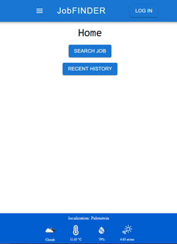
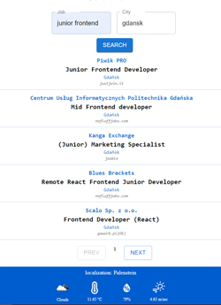
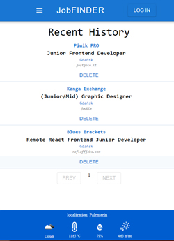

# JobFinder

## Table of contents

- [Overview](#overview)
  - [Links](#links)
- [Production](#production)
  - [Built with](#built-with)
- [Author](#author)

### Screenshot

## Overview

An application for searching job offers with pl.jooble.org API. 

Search Job: enter job type and city and display the list of job offers.

Recent History: after logging in / registering a user, each opened offer is stored in the Recent History.

Modify Your Profile Photo 
Use Menu to return to Home Page

Weather Panel: shows actual weather conditions

### Links

- Live Site URL: [JobFinder](https://jobfinder-app-d8a27.web.app)

## Production

### Built with

- React  (TypeScript, Hooks (useState, useEffect), Material UI, Axios)
- Firebase (Firestore Database, Authentication, Storage, Hosting)
- GitHub Actions

## Author

[@CoockieMonster](mailto:grubysweter@gmail.com)
